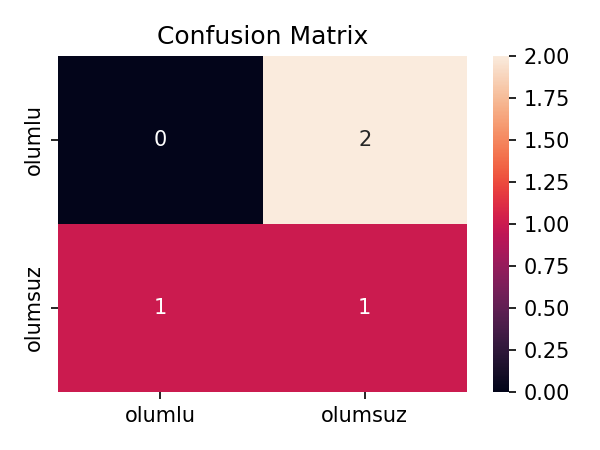

🇹🇷 Türkçe Duygu Analizi Pipeline
TF-IDF + Logistic Regression kullanarak Türkçe ürün yorumlarını olumlu / olumsuz olarak sınıflandırma.

Uçtan uca akış:
Ön işleme → Model eğitimi → Değerlendirme → Tek cümle tahmini

📂 Proje Yapısı
sentiment-analysis-pipeline/ ├─ data/ │ ├─ raw/amazon_sample.csv # Örnek Türkçe veri (18 yorum) │ └─ processed/train_processed.csv # Ön işlenmiş veri ├─ models/best_model.joblib # Kaydedilen model ├─ reports/ │ ├─ metrics.json # Skorlar │ └─ confusion_matrix.png # Karışıklık matrisi ├─ src/ │ ├─ preprocess.py # Veri temizleme + ön işleme │ ├─ train.py # Model eğitimi │ ├─ evaluate.py # Değerlendirme (rapor/grafik) │ └─ infer.py # Tek cümle tahmini └─ requirements.txt

⚙️ Çalıştırma Adımları
1️⃣ Ön işleme

python src/preprocess.py --input data/raw/amazon_sample.csv --text-col text --label-col label


2️⃣ Model eğitimi

python src/train.py


3️⃣ Değerlendirme

python src/evaluate.py


Rapor: reports/metrics.json

Görsel: reports/confusion_matrix.png

4️⃣ Tahmin (örnek cümleler)

python src/infer.py

📊 Sonuçlar

CV F1 (macro): ~0.70 (küçük örnek veri ile)

Holdout test seti küçüktür (4 cümle), bu yüzden metrikler oynaktır.
```markdown
## 📊 Sonuçlar
- CV F1 (macro): ~0.70
- Karışıklık matrisi:




Not: Bu repo demo amaçlıdır. Daha büyük Türkçe yorum datasıyla sonuçlar ciddi şekilde iyileşir.

🛠️ Kullanılan Teknolojiler

Python 🐍

scikit-learn (TF-IDF + Logistic Regression)

pandas, nltk, textblob (ön işleme)

matplotlib, seaborn (görselleştirme)

✨ Katkılar

Veri seti genişletilerek performans artırılabilir.

Farklı algoritmalar (SVM, RandomForest, BERT) denenebilir.

Streamlit/Gradio ile arayüz eklenebilir.